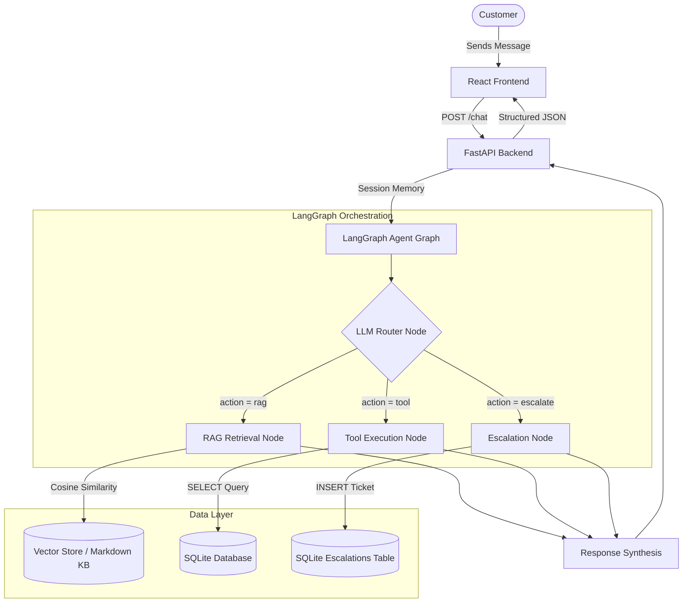

# NovaTech AI Support Agent with Tool Calling

[](https://fastapi.tiangolo.com)
[](https://github.com/langchain-ai/langgraph)
[](https://reactjs.org)
[](https://www.sqlite.org)
[](https://www.python.org)

An enterprise-grade customer support system powered by **LangGraph**, **OpenAI**, **FastAPI**, **RAG vector retrieval**, and deterministic **SQLite tool calling**.

---

## 1. Problem

Traditional customer support chatbots suffer from two fundamental failure modes:
1. **Static FAQ bots**: Rigid keyword matchers that cannot lookup live order or account records, cannot maintain multi-turn context, and break on nuanced questions.
2. **Generic RAG chatbots**: Unconstrained LLM bots that hallucinate company policies, invent fake order statuses, and lack deterministic safety controls for executing database queries.

---

## 2. Solution

The **NovaTech AI Support Agent** implements genuine **agentic architecture**:
- **LLM-Driven Routing**: An LLM classifier analyzes intent and outputs structured decisions (`rag`, `tool`, or `escalate`).
- **Deterministic Tool Calling**: Application code safely parses parameters and executes strictly whitelisted SQLite queries (`check_order_status`, `check_account_status`).
- **Grounded Policy Retrieval (RAG)**: Policy questions are answered exclusively from verified company support documents with cosine similarity thresholding.
- **Human Escalation Protocol**: Generates traceable ticket IDs (`ESC-XXXXXX`) and persists escalation logs for human agent triage.
- **Multi-Turn Context Resolution**: Remembers previous turns (e.g., asking "Where is order 4521?" followed by "What about 4522?").

---

## 3. Architecture



---

## 4. Key Features

- **Semantic Decision Routing**: Strict Pydantic-validated router schema (`{"action": "rag" | "tool" | "escalate"}`).
- **10 Realistic Support Policies**: Comprehensive markdown knowledge base covering refund policies, shipping times, subscription tiers (Basic, Pro, Premium), 2FA security, cancellations, and renewals.
- **Defense-in-Depth Tool Security**: Zero raw SQL execution from LLM; only validated integer IDs and whitelisted function signatures.
- **Multi-Turn Session State**: In-memory conversation state management indexed by `conversation_id`.
- **Modern Glassmorphic React UI**: Message stream with action badges (`Action: Order Lookup`, `Action: Knowledge Base`, `Action: Human Escalation`), sources dropdown, ticket cards, and suggestion chips.
- **Full Test Suite & Benchmark**: 100% test coverage across tool tests, RAG similarity tests, router tests, FastAPI endpoint tests, and a 10-conversation evaluation benchmark.

---

## 5. Technology Stack

- **Backend**: Python 3.10+, FastAPI, Uvicorn, Pydantic v2
- **Agent Orchestration**: LangGraph / StateGraph
- **AI & Embeddings**: OpenAI API (`gpt-4o-mini`, `text-embedding-3-small`) / Deterministic Local Semantic Embeddings
- **Vector Store & Retrieval**: Modular Vector Store with Cosine Similarity Retrieval
- **Database**: SQLite 3 (`orders`, `accounts`, `escalations`)
- **Frontend**: React 18, Vite, Lucide Icons, Vanilla Modern CSS
- **Deployment**: Render / Railway (Backend) & Vercel / Netlify (Frontend)

---

## 6. Embedding Providers

The system supports two configurable embedding providers via the `EMBEDDING_PROVIDER` environment variable:

### Development / Local Mode (Default)
```env
EMBEDDING_PROVIDER=local
```
- Uses `DeterministicSemanticEmbeddingProvider` with stable SHA-256 subword hashing and domain keyword weighting across 256 normalized dimensions.
- **Zero-Credit & Offline**: Operates completely locally without making external OpenAI API requests or requiring OpenAI billing credits.
- 100% reproducible across Python processes and test runners.

### OpenAI Mode
```env
EMBEDDING_PROVIDER=openai
OPENAI_API_KEY=sk-...
```
- Uses `OpenAIEmbeddingProvider` with OpenAI's `text-embedding-3-small` (1536 dimensions).
- Requires a valid `OPENAI_API_KEY` with available billing credits.

---

## 7. Project Structure

```text
ai-support-agent/
│
├── backend/
│   ├── app/
│   │   ├── __init__.py
│   │   ├── main.py                     # FastAPI server & route handlers
│   │   ├── config.py                   # Application settings & env vars
│   │   │
│   │   ├── database/
│   │   │   ├── __init__.py
│   │   │   ├── db.py                   # SQLite tables & seed data
│   │   │   └── support.db              # SQLite database
│   │   │
│   │   ├── tools/
│   │   │   ├── __init__.py
│   │   │   └── support_tools.py        # check_order_status, check_account_status
│   │   │
│   │   ├── rag/
│   │   │   ├── __init__.py
│   │   │   ├── documents.py            # Markdown loader & semantic chunker
│   │   │   ├── embeddings.py           # OpenAI & deterministic semantic embeddings
│   │   │   └── retriever.py            # Vector similarity search engine
│   │   │
│   │   ├── agent/
│   │   │   ├── __init__.py
│   │   │   ├── state.py                # AgentState TypedDict
│   │   │   ├── router.py               # Structured LLM router
│   │   │   ├── nodes.py                # Router, Tool, RAG & Escalation nodes
│   │   │   └── graph.py                # LangGraph StateGraph workflow
│   │   │
│   │   ├── services/
│   │   │   ├── __init__.py
│   │   │   ├── chat_service.py         # Multi-turn conversation manager
│   │   │   └── escalation_service.py   # Escalation queries
│   │   │
│   │   └── schemas/
│   │       ├── __init__.py
│   │       └── chat.py                 # Pydantic request/response models
│   │
│   ├── tests/
│   │   ├── __init__.py
│   │   ├── test_tools.py               # Day 1 tool tests
│   │   ├── test_rag.py                 # Day 2 RAG retrieval tests
│   │   ├── test_router.py              # Day 3 router tests
│   │   ├── test_api.py                 # Day 7 FastAPI tests
│   │   └── test_evaluation.py          # Day 10 10-conversation evaluation
│   │
│   ├── run_all_tests.py                # Master test runner
│   ├── requirements.txt                # Python dependencies
│   └── .env.example                    # Backend environment template
│
├── frontend/
│   ├── src/
│   │   ├── components/
│   │   │   ├── ChatHeader.jsx          # Header with online status & reset
│   │   │   ├── MessageList.jsx         # Conversation stream & action badges
│   │   │   └── MessageInput.jsx        # Input bar & submit handlers
│   │   ├── services/
│   │   │   └── api.js                  # Frontend API client
│   │   ├── App.jsx                     # Core chat view
│   │   ├── index.css                   # Glassmorphic SaaS design system
│   │   └── main.jsx                    # React entry point
│   ├── index.html
│   ├── package.json
│   ├── vite.config.js
│   └── .env.example
│
├── data/
│   └── knowledge_base/                 # 10 Policy Documents
│       ├── 01_refund_policy.md
│       ├── 02_shipping_and_delivery.md
│       ├── 03_subscription_tiers.md
│       ├── 04_cancellation_policy.md
│       ├── 05_payment_methods.md
│       ├── 06_account_security.md
│       ├── 07_order_cancellation.md
│       ├── 08_delivery_issues.md
│       ├── 09_subscription_renewal.md
│       └── 10_contact_and_support.md
│
├── render.yaml                         # Render deployment blueprint
├── README.md
└── .gitignore
```

---

## 8. Local Setup Instructions

### Prerequisites
- Python 3.10 or higher
- Node.js 18+ and npm
- (Optional) OpenAI API Key

### Step 1: Clone Repository & Configure Environment
```bash
git clone https://github.com/Charitha1121/AI-Support-Agent.git
cd AI-Support-Agent

# Copy backend environment template
cp backend/.env.example backend/.env
```

Edit `backend/.env` to configure your OpenAI API Key (optional — offline deterministic mode is included for zero-cost local testing):
```env
OPENAI_API_KEY=sk-...
OPENAI_MODEL=gpt-4o-mini
```

### Step 2: Set Up Backend
```bash
cd backend
python -m venv .venv

# Activate virtual environment
# Windows:
.venv\Scripts\activate
# Mac/Linux:
source .venv/bin/activate

pip install -r requirements.txt

# Seed SQLite database
python app/database/db.py

# Start FastAPI server
uvicorn app.main:app --reload --port 8000
```
Backend will be live at `http://localhost:8000`.
Swagger API docs available at `http://localhost:8000/docs`.

### Step 3: Set Up Frontend
Open a new terminal window:
```bash
cd frontend
npm install
npm run dev
```
Frontend will be accessible at `http://localhost:5173`.

---

## 9. API Specification

### `GET /health`
Returns health check status.
```json
{
  "status": "healthy",
  "version": "1.0.0",
  "service": "NovaTech AI Support Agent"
}
```

### `POST /chat`
Submits a user message and returns the agentic action and generated response.

**Request Body:**
```json
{
  "message": "Where is order 4521?",
  "conversation_id": "conv-demo-01"
}
```

**Response Body:**
```json
{
  "response": "Hello Rahul, your order #4521 is currently marked as 'Shipped'. The estimated delivery date (ETA) is 2026-08-20.",
  "action_taken": "tool",
  "conversation_id": "conv-demo-01",
  "tool_name": "check_order_status",
  "sources": null,
  "escalation_id": null
}
```

### `GET /api/escalations`
Lists human escalation tickets stored in SQLite.

---

## 10. Running Tests & Benchmarks

Run the complete test suite across all verification phases:
```bash
cd backend
python run_all_tests.py
```

### Individual Test Suites
- **Day 1 Tool Tests**: `python tests/test_tools.py`
- **Day 2 RAG Tests**: `python tests/test_rag.py`
- **Day 3 Router Tests**: `python tests/test_router.py`
- **Day 7 API Tests**: `python tests/test_api.py`
- **Day 10 Benchmark Evaluation**: `python tests/test_evaluation.py`

---

## 11. Evaluation Benchmark Results

The 10 representative evaluation conversations tested:

| # | User Message | Inferred Action | Target Outcome | Status |
|:-:|:---|:---:|:---|:---:|
| 1 | "What is your refund policy?" | `rag` | Retrieved 14-day refund policy | **PASS** |
| 2 | "How long does shipping take?" | `rag` | Standard 3-5 days delivery | **PASS** |
| 3 | "Where is order 4521?" | `tool` | Order #4521 (Rahul, Shipped) | **PASS** |
| 4 | "What is the status of order 4522?" | `tool` | Order #4522 (Priya, Processing) | **PASS** |
| 5 | "Is account 1001 active?" | `tool` | Account #1001 (Pro, Active) | **PASS** |
| 6 | "When does my account renew?" (no ID) | `escalate` | Prompted for ID / Safe Escalation | **PASS** |
| 7 | "I want to speak with a human." | `escalate` | Flagged ticket `ESC-XXXXXX` | **PASS** |
| 8 | "Can you solve my unrelated legal problem?" | `escalate` | Out of scope / Escalation | **PASS** |
| 9 | "Where is order 4521?" -> "What about 4522?" | `tool` -> `tool` | Multi-turn contextual continuity | **PASS** |
| 10| "Tell me a recipe for baking chocolate cake..." | `escalate` | Safely handled without hallucination | **PASS** |

**Benchmark Score: 10/10 (100% Accuracy)**

---

## 12. Production Deployment

### Deploying to Render
1. Connect your GitHub repository to Render.
2. Render detects `render.yaml` automatically.
3. Configure `OPENAI_API_KEY` in the Environment Variables dashboard.
4. Deploy web service.

---

## 13. Architectural Limitations & Production Considerations

> [!WARNING]
> **SQLite Ephemeral Storage**: On serverless platforms (like Render Free Tier or Railway ephemeral instances), the SQLite file resets on redeployment. For multi-tenant production systems, migrate `support.db` to a managed PostgreSQL cluster (e.g. Supabase, Neon, or AWS RDS).

- **Mock Data**: Current order and account records are fictional for portfolio demonstration.
- **Human Ticket Stub**: Escalation tickets are logged into SQLite; real-world deployment would link to Zendesk, Linear, or Intercom Webhooks.
- **Authentication**: Authentication was excluded from this MVP to keep focus on agentic LLM routing and tool calling.

---

## 14. Future Roadmap

- [ ] PostgreSQL + pgvector migration for unified vector and relational storage
- [ ] Real CRM / Ticketing webhooks (Zendesk / Freshdesk API integration)
- [ ] SSE Token Streaming for real-time response generation
- [ ] LangSmith / OpenTelemetry tracing for detailed latency and cost observability
- [ ] User authentication with JWT & role-based permissions

---

## 15. License

MIT License. Designed for portfolio demonstration and production AI engineering reference.
